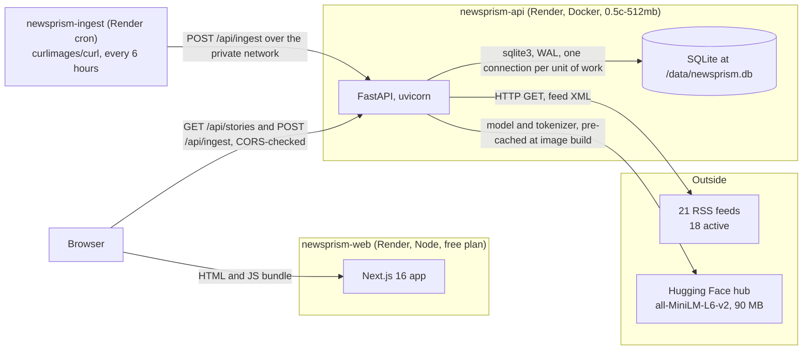
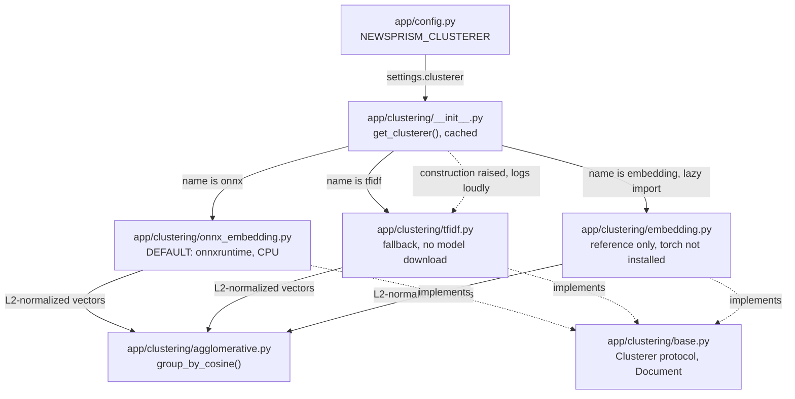
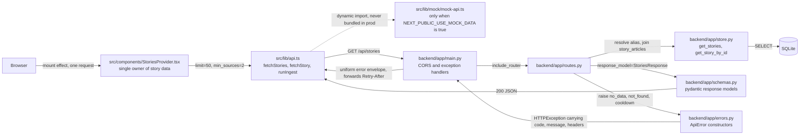
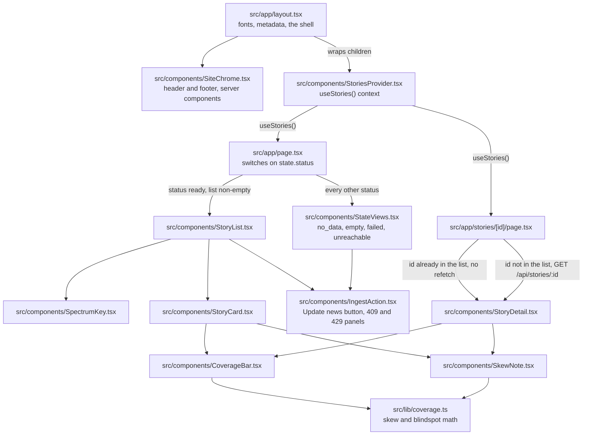
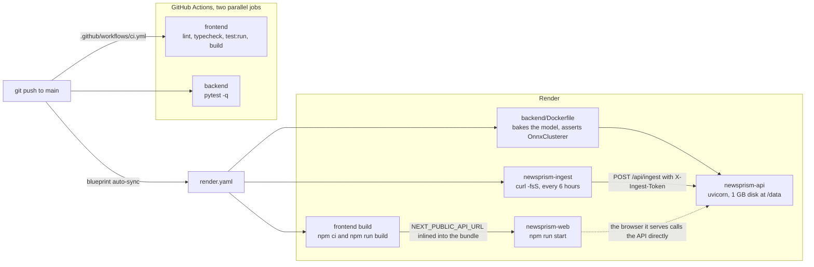

# newsprism architecture

Generated from the code at `2e77745` on 2026-09-14.

Six diagrams, each a flow the system actually performs. Every node is a real
file or a real deployed process; every edge is a call, a request, or a config
value that exists in the code. Under each diagram is a table of its files as
clickable links.

---

## 1. System map

What runs where, and what it talks to. No files yet, just processes.

**The browser never talks to the Next.js server for data.** All fetching is
client-side and goes straight to the API, which is why `NEXT_PUBLIC_API_URL`
has to be a public URL and why CORS is load-bearing rather than incidental.

| File | Responsibility |
|---|---|
| [render.yaml](render.yaml) | Declares all three services, the disk, the cron schedule, and which env vars cannot be auto-wired |
| [backend/Dockerfile](backend/Dockerfile) | Builds the API image and bakes the model into it |
| [backend/app/main.py](backend/app/main.py) | FastAPI app, CORS middleware, error handlers, startup logging |
| [backend/app/db.py](backend/app/db.py) | Schema, connection handling, the v1 migration |

---

## 2. Ingest: how data gets in

One synchronous run, tens of seconds to several minutes. This is the flow the
whole product depends on.

```mermaid
flowchart LR
  post["app/routes.py<br>POST /api/ingest"]
  lock["app/pipeline.py<br>single-flight lock, cooldown"]
  outlets["app/outlets.py<br>outlet registry with lean tags"]
  rss["app/rss.py<br>fetch, parse, clean, dedupe"]
  upsert["app/store.py<br>upsert_articles()"]
  window["app/store.py<br>articles_for_clustering()"]
  clus["app/clustering/__init__.py<br>get_clusterer()"]
  agg["app/clustering/agglomerative.py<br>average linkage, cosine 0.62"]
  medoid["app/pipeline.py<br>_pick_representative()"]
  track["app/tracking.py<br>match_groups_to_stories()"]
  persist["app/store.py<br>track_and_persist_stories()"]
  db[("SQLite<br>app/db.py")]

  post -->|"try_acquire_ingest_lock(), else 409"| lock
  lock -->|"run_ingest()"| outlets
  outlets -->|"active_outlets()"| rss
  rss -->|"httpx and feedparser, 8 worker threads"| upsert
  upsert -->|"INSERT OR IGNORE, url-hash id"| db
  upsert -->|"recluster()"| window
  window -->|"SELECT inside the 4-day window"| clus
  clus -->|"vectors() then cluster(), encodes twice"| agg
  agg -->|"anonymous groups of article ids"| medoid
  medoid -->|"groups carrying a title and summary"| track
  track -->|"inherit, mint, or retire into an alias"| persist
  persist -->|"rewrite story_articles, recompute archived"| db
```

**Identity is separate from composition.** The clusterer returns anonymous
groups. [tracking.py](backend/app/tracking.py) is the only thing that decides
which durable story id a group inherits, and it is pure: no database, no I/O,
so the matching rule is unit-testable on its own.

**The double encode is visible right here.** `recluster()` calls
`clusterer.vectors()` and then `clusterer.cluster()`, and `cluster()` encodes
again internally. That is roughly 25s of a 64s run, and fixing it means
changing the `Clusterer` protocol so one pass returns both.

| File | Responsibility |
|---|---|
| [app/routes.py](backend/app/routes.py) | Endpoint definitions, param clamping, the 401 / 429 / 409 ordering |
| [app/pipeline.py](backend/app/pipeline.py) | Orchestrates the run; owns the single-flight lock and medoid selection |
| [app/outlets.py](backend/app/outlets.py) | The outlet registry: name, feed URL, lean, active flag |
| [app/rss.py](backend/app/rss.py) | Parallel feed fetch, HTML stripping, URL normalization, cross-outlet dedupe |
| [app/store.py](backend/app/store.py) | Every SQL statement; the bridge between tracking's decisions and the tables |
| [app/tracking.py](backend/app/tracking.py) | Pure story-identity matching: containment scoring, greedy assignment, aliases |
| [app/db.py](backend/app/db.py) | Connection context manager and the schema |

---

## 3. The clustering seam

The part most likely to be swapped, so everything else only ever sees the
protocol.

**Two separate fallbacks to TF-IDF exist**, and they fire at different moments.
The dotted edge above is construction-time, in the factory. There is a second
one at *use* time in `pipeline.recluster()`, which catches an embedding failure
mid-run and retries the whole clustering with TF-IDF. Both keep the endpoints
answering, and both degrade the product quietly: TF-IDF produces about 9
multi-source clusters where the embedding backend produces 50 or more.

**`embedding.py` is dead by design, not by accident.** Nothing imports it
unless `NEWSPRISM_CLUSTERER=embedding`, and its dependencies live in
`requirements-torch.txt`, which is installed neither in CI nor in the image. It
exists to re-verify ONNX equivalence after a model change.

| File | Responsibility |
|---|---|
| [app/clustering/base.py](backend/app/clustering/base.py) | The protocol every clusterer implements, and the `Document` text rule |
| [app/clustering/\_\_init\_\_.py](backend/app/clustering/__init__.py) | Factory, caching, construction-time fallback |
| [app/clustering/onnx_embedding.py](backend/app/clustering/onnx_embedding.py) | Tokenize, run the ONNX session, masked mean-pool, normalize |
| [app/clustering/tfidf.py](backend/app/clustering/tfidf.py) | Vectorizer fallback with its own threshold scale |
| [app/clustering/embedding.py](backend/app/clustering/embedding.py) | torch reference implementation, kept for equivalence checks |
| [app/clustering/agglomerative.py](backend/app/clustering/agglomerative.py) | The grouping step both backends share |
| [app/config.py](backend/app/config.py) | Env parsing; every setting has a working default |

---

## 4. Read path: one GET serves everything

**The list response carries every article**, so the detail route needs no
request of its own when the story is already in the list.
`GET /api/stories/:id` exists for the ids the windowed list cannot answer for:
aged out, past the limit, or retired into another story by a merge.

**Every non-2xx leaves through `main.py`.** FastAPI's defaults produce
`{"detail": ...}` for validation errors and unhandled exceptions; those handlers
reshape all of it, so no path out of the app produces a body the frontend was
not built to read.

| File | Responsibility |
|---|---|
| [src/lib/api.ts](frontend/src/lib/api.ts) | The only module that touches the network; normalizes every failure into `ApiError` |
| [src/lib/config.ts](frontend/src/lib/config.ts) | The only place the API base URL and the timeouts are resolved |
| [src/lib/mock/mock-api.ts](frontend/src/lib/mock/mock-api.ts) | Fixture-backed stand-in so the UI runs with no backend |
| [app/schemas.py](backend/app/schemas.py) | Response shapes dictated by the frozen API contract |
| [app/errors.py](backend/app/errors.py) | `ApiError` and one constructor per contract error code |
| [docs/api-contract.md](docs/api-contract.md) | The frozen interface both halves were built against, in parallel |

---

## 5. UI composition

Which component renders which, and where the state lives.

**One provider for the whole app, mounted in the root layout.** Navigating from
the list into a story refetches nothing, and a deep link on a cold load goes
through exactly the same states the list does.

**`IngestAction` is reachable from two places on purpose**: inside a populated
list, and inside the cold-start `no_data` state. A cold clone lands on the
second one, which is the only affordance a brand-new database offers.

| File | Responsibility |
|---|---|
| [src/app/layout.tsx](frontend/src/app/layout.tsx) | Root shell; mounts the provider above header, main, and footer |
| [src/app/page.tsx](frontend/src/app/page.tsx) | Story list route; one branch per state a real user hits |
| [src/app/stories/\[id\]/page.tsx](frontend/src/app/stories/[id]/page.tsx) | Detail route; list fast path, direct-lookup fallback, alias URL rewrite |
| [src/components/StoriesProvider.tsx](frontend/src/components/StoriesProvider.tsx) | All story and ingest state, staleness guards, the elapsed-time ticker |
| [src/components/StoryList.tsx](frontend/src/components/StoryList.tsx) | Ordered cards, generated-at line, spectrum key |
| [src/components/StoryCard.tsx](frontend/src/components/StoryCard.tsx) | One story summarized, with its coverage bar |
| [src/components/StoryDetail.tsx](frontend/src/components/StoryDetail.tsx) | Full story with its sources grouped by lean |
| [src/components/CoverageBar.tsx](frontend/src/components/CoverageBar.tsx) | The proportional spread bar, the product's core visual |
| [src/components/SkewNote.tsx](frontend/src/components/SkewNote.tsx) | Prose reading of the skew, including blindspots |
| [src/components/SpectrumKey.tsx](frontend/src/components/SpectrumKey.tsx) | Legend for the lean colors |
| [src/components/StateViews.tsx](frontend/src/components/StateViews.tsx) | Every non-ready state as a designed screen |
| [src/components/IngestAction.tsx](frontend/src/components/IngestAction.tsx) | The Update news button and every outcome panel |
| [src/components/SiteChrome.tsx](frontend/src/components/SiteChrome.tsx) | Masthead and footer; prints the API URL and the mock badge |
| [src/lib/coverage.ts](frontend/src/lib/coverage.ts) | Skew, dominant lean, and blindspot calculations |

Shared utilities, imported nearly everywhere and left off the diagram to keep it
readable: [src/lib/types.ts](frontend/src/lib/types.ts) (the contract's shapes in
TypeScript), [src/lib/lean.ts](frontend/src/lib/lean.ts) (lean order and labels),
[src/lib/format.ts](frontend/src/lib/format.ts) (dates, elapsed time, hostnames).

---

## 6. Build, deploy, schedule

**CI never installs `requirements-torch.txt`.** It tests the dependency set the
deployment actually has, which is why the torch reference clusterer is not
exercised there.

**The image build asserts that the clusterer it constructed is `OnnxClusterer`.**
Without that, a blocked model download would degrade to TF-IDF and still render
a page, just without the coverage spread the product exists to show.

**`NEXT_PUBLIC_API_URL` is compiled in, not read at runtime.** Changing it needs
a rebuild with the cache cleared; a restart leaves the old URL inside the
JavaScript.

**The cron's token buys a cooldown bypass, not access.** `POST /api/ingest` is
public and bounded by the single-flight lock plus the cooldown. Nothing bypasses
the lock, because two concurrent runs would exhaust the 512 MB host.

| File | Responsibility |
|---|---|
| [.github/workflows/ci.yml](.github/workflows/ci.yml) | Frontend and backend as independent parallel jobs |
| [render.yaml](render.yaml) | The blueprint all three services were created from |
| [backend/Dockerfile](backend/Dockerfile) | Installs deps, warms the model cache, then sets `HF_HUB_OFFLINE=1` |
| [backend/requirements.txt](backend/requirements.txt) | The set that is actually deployed |
| [backend/requirements-torch.txt](backend/requirements-torch.txt) | The extra, installed only to re-verify ONNX equivalence |
| [frontend/package.json](frontend/package.json) | The script contract that CI and Render both call |

---

## What this document does not cover

Deliberate omissions, so they read as decisions rather than gaps:

- **Tests.** [backend/tests/](backend/tests/) and the `*.test.ts(x)` files beside
  their subjects are on no diagram. What is worth testing, and why, is
  [docs/testing.md](docs/testing.md).
- **Styling.** Tailwind config, `globals.css`, and font wiring are not flows.
- **The local driver.**
  [.claude/skills/run-newsprism/driver.mjs](.claude/skills/run-newsprism/driver.mjs)
  launches both halves and drives the UI over CDP. It is development tooling and
  sits outside every path above.
- **Pure helpers** are listed in the section 5 legend rather than drawn, since
  they are imported nearly everywhere and would turn that tree into a mesh.

## One thing the trace turned up

**`GET /api/outlets` is implemented on both sides and called by neither.**
[app/routes.py](backend/app/routes.py) serves it,
[app/schemas.py](backend/app/schemas.py) types it,
[src/lib/api.ts](frontend/src/lib/api.ts) exports `fetchOutlets()`, and
[src/lib/mock/mock-api.ts](frontend/src/lib/mock/mock-api.ts) mocks it. The only
caller in the repo is `frontend/src/lib/api.test.ts`. It is a contract endpoint
both agents built in parallel that no screen ever wired up, so it is tested,
maintained, and dead. Worth either a UI that uses it, such as a methodology page
listing the registry and its lean tags, or an explicit line in the contract
saying it exists for external consumers.
